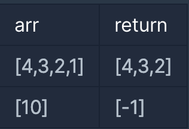

## 선택 문제
1번 문제) 제일 작은 수 제거하기

### 문제 설명
정수를 저장한 배열, arr 에서 가장 작은 수를 제거한 배열을 리턴하는 함수, solution을
완성해주세요. 단, 리턴하려는 배열이 빈 배열인 경우엔 배열에 -1을 채워 리턴하세요.
예를들어 arr이 [4,3,2,1]인 경우는 [4,3,2]를 리턴 하고, [10]면 [-1]을 리턴 합니다.
제한 조건

- arr은 길이 1 이상인 배열입니다.
- 인덱스 i, j에 대해 i ≠ j이면 arr[i] ≠ arr[j] 입니다.

## 문제 이해 
1. 배열인 arr가 주어진다.
2. 주어진 arr의 배열에서 최소값을 제거한 배열을 리턴해야한다.
3. 인덱스 i, j에 대해 i != j 이고 arr[i] != arr[j] 이다.
4. 최소값은 하나이다.
5. 만약 arr 배열 값이 하나라면 배열에 -1을 리턴한다.

## 문제 해결
1. 먼저 리턴할 값을 저장해 둘 answer 배열을 선언한다. 이때 배열은 최소값 하나가 빠진 배열이니 arr.length -1 크기로 선언한다.
2. 입력받는 arr 의 길이가 1이면 -1을 answer 배열에 담아 리턴한다.
3. arr 배열에서 Math.min()을 사용해 최소값을 찾는다.
4. for문을 통해 돌면서 최소값과 비교해 같은 값이면 continue로 넘어간다.
5. 최소값과 비교해 다른 값이면 answer 배열에 담는다.
6. 이때 num 값을 미리 선언해 answer 배열에 값을 담을 때 num을 인덱스 값으로 사용하여 차례대로 값을 저장한다.
7. answer 배열을 리턴한다.